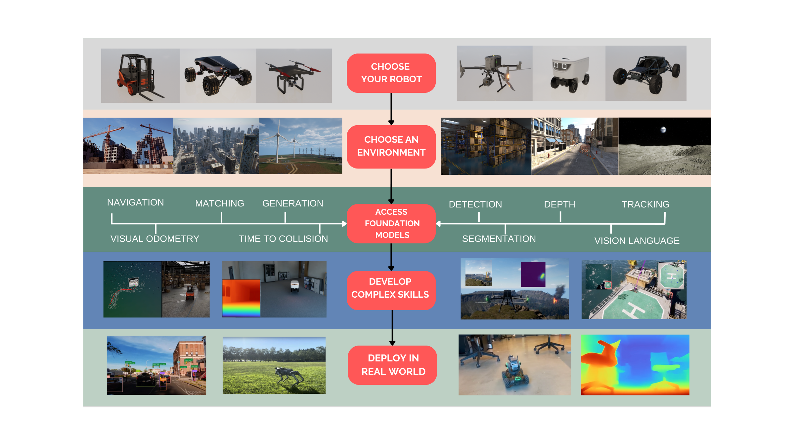

GRID consists of a model bank composed of several foundation models as well as an LLM (currently GPT-4) for orchestration and code generation. We make use of the following open-source models as part of GRID. All credits go to the original authors.

| Task              | Model |
|-------------------|-------|
| Object Detection  | [GroundingDINO](https://github.com/IDEA-Research/GroundingDINO), [YOLO](https://github.com/ultralytics/ultralytics)      |
| Segmentation      | [GroundedSAM](https://github.com/IDEA-Research/Grounded-Segment-Anything), [CLIPSeg](https://github.com/timojl/clipseg)      |
| VQA               | [LLaVa](https://github.com/haotian-liu/LLaVA), [GIT](https://huggingface.co/microsoft/git-base-textvqa)      |
| Captioning        | [BLIP2](https://huggingface.co/Salesforce/blip2-opt-2.7b)      |
| Visual Odometry   | [DP-VO](https://github.com/princeton-vl/DPVO)      |
| Point Tracking    | [TapNet](https://github.com/google-deepmind/tapnet)      |
| Time to Collision | [Optical Expansion](https://github.com/gengshan-y/expansion)      |

Please see the full list of available models here: [GRID AI Models](https://docs.scaledfoundations.ai/models/index.html)

Running `/GRID/chat2grid.py` will open up a conversation with the LLM in GRID, where users can start by controlling the drone in AirGen through language commands, or pose more interesting perception-action problems that the LLM can start writing code for. Here is an example: 

## Using the Foundation Models

Coming soon!

## Bring your own model

See the [external modules](https://docs.scaledfoundations.ai/portal/advanced_mode.html#load-external-modules-in-grid) section on our docs for more information.

## Configuring the LLM

Coming soon! 
